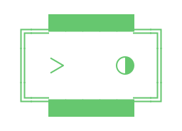
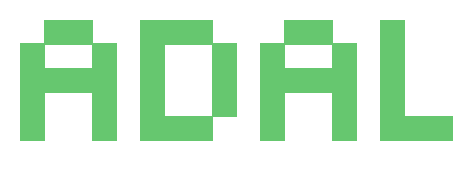

<p align="center">
  <a href="https://sylph.ai">
    
    
  </a>
</p>

# AdaL Vibecoding Bootcamp

Welcome to the AdaL Vibecoding Bootcamp repository! 🚀

This repository contains all the materials, curriculum, and code projects for the bootcamp.

## 🗓️ Bootcamp Schedule

- 🎨 **Day 1: Clone the style of any website**
  - Learn to use an AI agent (Gemini 3.1 Pro) to clone a reference URL into a Next.js project.
  - **Marketplace Example**: [Framer Templates](https://www.framer.com/marketplace/templates)
  - **The example we use**: [xtract.framer.ai](https://xtract.framer.ai/)

- ⚙️ **Day 2: Build the backend**
  - **Tutor**: Zach Wilson
  - Transition from the frontend landing page to building a robust backend infrastructure.

---

## 📚 Repository Structure

- 📂 **`class-materials/`**: Core learning resources.
  - 📄 `01_bootcamp_curriculum_short.md`: Bootcamp structure and goals.
  - 📊 `slides-build-landing-page.html`: Guide on vibecoding a landing page.
  - 📊 `slides-adal-cli-howto.html`: Instructions on using the AdaL CLI tool.
- 💻 **`landing-page/`**: First vibecoding session code for the landing page clone.
- 💻 **`landing_page_2/`**: Second vibecoding session code for the landing page clone.
- 🤖 **`AGENTS.md`**: Guidelines and context for AI agents working in this repository.

## 🛠️ Getting Started

To explore the frontend projects, navigate to their respective directories and follow the instructions in their local `README.md` files.

For example, to run the updated landing page:

```bash
cd landing_page_2
npm install
npm run dev
```

Happy vibecoding! ✨
